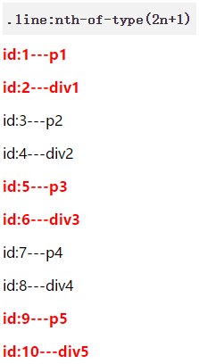
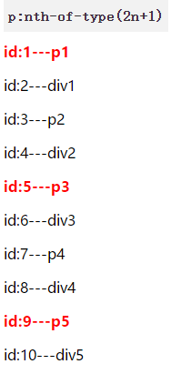
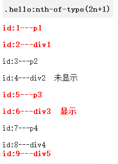
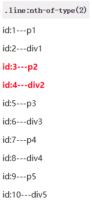

---
css 基础 -- nth-of-type
---

看如下代码， 如果你知道哪些内容会以 **红色** 输出， 说明你基础扎实， 反正我是晕菜的。 

```html
<h3><code>.line:nth-of-type(2n+1)</code></h3>
<div class="wrap">
    <p class="line hello">id:1---p1</p>
    <div class="line">id:2---div1</div>
    <p class="line">id:3---p2</p>
    <div class="line hello">id:4---div2</div>
    <p class="line">id:5---p3</p>
    <div class="line hello">id:6---div3</div>
    <p class="line">id:7---p4</p>
    <div class="line">id:8---div4</div>
    <p class="line">id:9---p5</p>
    <div class="line">id:10---div5</div>
</div>
```

```css
.wrap .line:nth-of-type(2n+1) {
    font-size: 16px;
    font-weight: bold;
    color: red;
}
```

结果如下， 不知你是否正确？ 这篇的目的就是搞懂这些小知识点， 不然我都觉得有些不好意思。 



## nth-of-type

> 这个 CSS 伪类匹配文档树中在其之前具有 an+b-1 个相同兄弟节点的元素， 其中 n 为正值或零值。 简单点说就是， 这个选择器匹配那些在相同兄弟节点中的位置与模式 an+b 匹配的相同元素。 

依旧混乎乎， 还是结合几个例子看下： 

### p:nth-of-type(2n+1)

```html
<h3><code>p:nth-of-type(2n+1)</code></h3>
<style>
    .wrap p:nth-of-type(2n+1) {
        font-size: 16px;
        font-weight: bold;
        color: red;
    }
</style>
<div class="wrap">
    <p class="line">id:1---p1</p>
    <div class="line">id:2---div1</div>
    <p class="line">id:3---p2</p>
    <div class="line">id:4---div2</div>
    <p class="line">id:5---p3</p>
    <div class="line">id:6---div3</div>
    <p class="line">id:7---p4</p>
    <div class="line">id:8---div4</div>
    <p class="line">id:9---p5</p>
    <div class="line">id:10---div5</div>
</div>
```



可能发现不出自己的问题， 毕竟符合预期显示了 **奇数 p 标签**。 

### .line:nth-of-type(2n+1)

2n+1 是取 **符合条件的奇数** 标签（我试过 2n-1 也结果一致， 如果不对请 issue :octocat:）

```html
<h3><code>.line:nth-of-type(2n+1)</code></h3>
<style>
    .wrap-a .line:nth-of-type(2n+1) {
        font-size: 16px;
        font-weight: bold;
        color: red;
    }
</style>
<div class="wrap-a">
    <p class="line">id:1---p1</p>
    <div class="line">id:2---div1</div>
    <p class="line">id:3---p2</p>
    <div class="line">id:4---div2</div>
    <p class="line">id:5---p3</p>
    <div class="line">id:6---div3</div>
    <p class="line">id:7---p4</p>
    <div class="line">id:8---div4</div>
    <p class="line">id:9---p5</p>
    <div class="line">id:10---div5</div>
</div>
```

和上面不同， 标签 p 换成了 **样式选择器**， 那哪些符合条件？ 


原以为和上例一样， 会类似按照 .line 取奇数做显示， 结果却按照元素标签 element。 

其实 .line:nth-of-type(2n+1) 是按照元素类型做个集合， 然后再根据不同的集合取奇数显示。 这就解释了为何 p 和 div 都有显示。 而非揉在一起间隔显示。 

### .hello:nth-of-type(2n+1)

为了证明上例的猜想， 用了 .hello 选择器做区分， 确认了 **标签类别** 和伪类共同决定哪些显示。 注意： id:3---p2 内容没有显示。 

```html
<h3><code>.hello:nth-of-type(2n+1)</code></h3>
<style>
    .wrap-b .hello:nth-of-type(2n+1) {
        font-size: 16px;
        font-weight: bold;
        color: red;
    }
</style>
<div class="wrap-b">
    <p class="hello">id:1---p1</p>
    <div class="hello">id:2---div1</div>
    <p class="hello">id:3---p2</p> <!-- 虽 .hello 奇数，但 p 标签偶数。不输出 -->
    <div class="">id:4---div2</div>
    <p class="hello">id:5---p3</p>
    <div class="hello">id:6---div3</div>
    <p class="">id:7---p4</p>
    <div class="hello">id:8---div4</div>
    <div class="hello">id:9---div5</div>
</div>
```



### .line:nth-of-type(2)

```html
<h3><code>.line:nth-of-type(2)</code></h3>
<style>
    .wrap-c .line:nth-of-type(2) {
        font-size: 16px;
        font-weight: bold;
        color: red;
    }
</style>
<div class="wrap-c">
    <p class="line">id:1---p1</p>
    <div class="line">id:2---div1</div>
    <p class="line">id:3---p2</p>
    <div class="line">id:4---div2</div>
    <p class="line">id:5---p3</p>
    <div class="line">id:6---div3</div>
    <p class="line">id:7---p4</p>
    <div class="line">id:8---div4</div>
    <p class="line">id:9---p5</p>
    <div class="line">id:10---div5</div>
</div>
```

这其实原来就知道， 只是如果没有定义特别标签， 就会把符合条件的选择器都取第二项显示。 



## 参考

> 我只是知识点的“加工者”， 更多内容请查阅原文链接 :thought_balloon: ， 同时感谢原作者的付出： 

- [:nth-of-type MDN](https://developer.mozilla.org/zh-CN/docs/Web/CSS/:nth-of-type#语法)

- [CSS3选择器:nth-child和:nth-of-type之间的差异 张鑫旭](https://www.zhangxinxu.com/wordpress/2011/06/css3%E9%80%89%E6%8B%A9%E5%99%A8nth-child%E5%92%8Cnth-of-type%E4%B9%8B%E9%97%B4%E7%9A%84%E5%B7%AE%E5%BC%82/)

- [The Difference Between :nth-child and :nth-of-type css-tricks](https://css-tricks.com/the-difference-between-nth-child-and-nth-of-type/)

