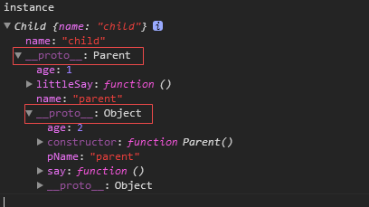
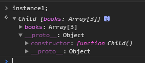
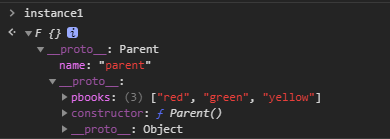
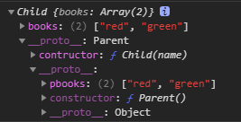

---
js基础--面向对象 4.几种继承方式
---

时间久了，又都忘记了，再次加强印象和理解。

# 原型链继承

## 示例

```js
function Parent() {
	this.name = 'parent';
}
Parent.prototype.pName = 'parent';
Parent.prototype.age = 2;
Parent.prototype.say = function() {
	console.log(this.name + ' is called');
};

function Child() {
	this.name = 'child';
}
Child.prototype = new Parent();
Child.prototype.age = 1;
Child.prototype.littleSay = function() {
	console.log(this.name + ' is called');
};

var instance = new Child();
console.log(instance.name); // child
console.log(instance.pName); // parent
instance.say(); // child is called
instance.littleSay(); // child is called
```

根据上例，能看到 **原型继承** 的特点：

- Child 有的属性直接获取，如果没有向 Child 原型对象寻找
- 再没有，则像 Parent 属性，和 Parent 原型对象寻找
- 虽然是继承 Parent 实例，但是内部的引用 this 是指向 Child 的（我之前一直错误以为是 Parent，特别指明下）

## 原理

```js
Child.prototype = new Parent();
```

上面这句其实就是原型继承的实现的核心：重写 Child 原型对象 **Child.prototype** 的引用（原来 constructor 指向 Child 构造函数），现在指向 Parent 实例对象，这样 Child 实例就能拿到 Parent 实例属性和原型对象的属性了。

再看下 instance 控制台的打印核实下：



## 缺点

虽然每次会新创建父类实例，但还是共享了 Parent 的原型对象。

```js
function Parent() {}
Parent.prototype.books = ['red', 'green'];

function Child() {}
Child.prototype = new Parent();

var instance1 = new Child();
instance1.books.push('yellow');

var instance2 = new Child();
console.log(instance2.books); // ["red", "green", "yellow"]
```

# 借用构造函数继承

使用 **call、apply** 在创建 Child 实例的时候借用 Parent 构造函数，这样每次新的 Child 实例都有一份新的 Parent 属性；同时因为是借用，只是改变了执行环境，Child 实例 **proto** 原型链还是指向 Child 构造函数，从而避免了原型共享的污染问题。

## 示例

```js
function Parent() {
	this.books = ['red', 'green'];
}
Parent.prototype.pbooks = ['pred', 'pgreen'];

function Child() {
	Parent.call(this);
}

var instance1 = new Child();
instance1.books.push('yellow');
instance1.pbooks; // undefined

var instance2 = new Child();
console.log(instance2.books); // ["red", "green"]
```



## 优点

利用 call、apply api 传参的特性，可以像 Parent 传参。

```js
function Child(...args) {
	Parent.call(this, ...args);
}
```

## 缺点

虽然解决了 **原型继承** 属性共享问题，但也就没法共享访问 Parent 定义的方法了。

# 组合继承

原型链继承+借用构造函数继承，取长补短。

## 示例

```js
function Parent() {
	console.log('parent is called'); // 输出两次
	this.name = 'parent';
}
Parent.prototype.pbooks = ['red', 'green'];
Parent.prototype.say = function() {
	console.log('parent say()');
};

function Child() {
	Parent.call(this); // 第二次
	this.name = 'child';
}
Child.prototype = new Parent(); // 第一次

var instance1 = new Child();
instance1.pbooks.push('yellow');

instance1.say(); // parent say()

var instance2 = new Child();
console.log(instance2.pbooks); // ["red", "green", "yellow"]
```

## 缺点

但也有其不足之处，**调用 2 次父类的构造函数**。

同时原型共享的问题依旧存在，但可以通过 Parent.prototype 有意识定义方法，而非引用类型的数据。

# 原型式继承

> 道格拉夫·克罗克

在函数方法内部创建全新的构造方法，将需要继承对象赋值于原型。

## 示例

```js
function object(o) {
	// 相当于child
	function F() {}
	F.prototype = o; // 浅复制
	return new F();
}
```

```js
function Parent() {
	this.name = 'parent';
}
Parent.prototype.pbooks = ['red', 'green'];
var instance1 = object(new Parent());
instance1.pbooks.push('yellow');

var instance2 = object(new Parent());
instance2.pbooks; // ["red", "green", "yellow"]
```



值得注意 ES5 的 **Object.create()** 规范了原型式继承

# 寄生组合式继承

## 示例

```js
function Parent() {
	this.books = ['red', 'green'];
}
Parent.prototype.pbooks = ['red', 'green'];

function Child(name) {
	//借用构造函数继承
	Parent.call(this);
}
function inherits(Child, Parent) {
	// 没有像组合继承那样 new Parent,而是通过原型对象来创建一个新的原型对象
	var prototype = Object.create(Parent.prototype);
	// 重新设定引用，Child而非Parent或其他
	prototype.contructor = Child;
	Child.prototype = prototype;
}
// 对于不支持Object.create的浏览器，还是用组合继承。参考：https://github.com/isaacs/inherits/blob/master/inherits_browser.js
inherits(Child, Parent);
var instance = new Child();
console.log(instance);
```



## 特点

- 保留了原型链的整个链式引用
- 不像 **组合继承** 二次创建 Parent 对象的创建，避免额外属性的创建
- 缺点：注意原型共享问题还是存在

over
