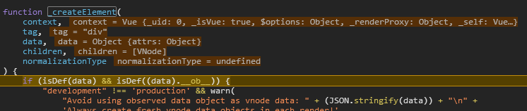

# Vue 初始化-渲染 render

```js
initRender(vm);

// E:\github\vue\src\core\instance\render.js
function initRender(vm: Component) {
  // ...
}
```

首先初始化 **vm** 一些内部属性

```js
vm._vnode = null; // the root of the child tree
vm._staticTrees = null; // v-once cached trees
const options = vm.$options;
const parentVnode = (vm.$vnode = options._parentVnode); // the placeholder node in parent tree
const renderContext = parentVnode && parentVnode.context;
vm.$slots = resolveSlots(options._renderChildren, renderContext);
vm.$scopedSlots = emptyObject;
// ...
vm._c = (a, b, c, d) => createElement(vm, a, b, c, d, false);
vm.$createElement = (a, b, c, d) => createElement(vm, a, b, c, d, true);

// $attrs & $listeners are exposed for easier HOC creation.
// they need to be reactive so that HOCs using them are always updated
const parentData = parentVnode && parentVnode.data;
```

这里注意 **vm.\$createElement**、**vm.\_c** 方法，很多地方就用到了。

并且从文件路径 src\core\vdom\create-element.js 上看，应该猜到用于 vdom 渲染。

```js
export function createElement (context: Component,tag: any,data: any,children: any,normalizationType: any,alwaysNormalize: boolean
): VNode | Array<VNode> {
  ...
  return _createElement(context, tag, data, children, normalizationType)
}
```

来看下本体 **\_createElement** ，其接受 5 个参数 "vm, a, b, c, d, true/false"

<!-- https://cn.vuejs.org/v2/guide/render-function.html#createElement-%E5%8F%82%E6%95%B0 -->

```js
export function _createElement(context: Component, tag?: string | Class<Component> | Function | Object, data?: VNodeData, children?: any, normalizationType?: number): VNode | Array<VNode> {
  //...
}
```



```js
if (isDef(data) && isDef((data: any).__ob__)) {
  return createEmptyVNode();
}
if (!tag) {
  return createEmptyVNode();
}
//...
let vnode, ns;
if (typeof tag === 'string') {
  let Ctor;
  ns = (context.$vnode && context.$vnode.ns) || config.getTagNamespace(tag);
  if (config.isReservedTag(tag)) {
    // platform built-in elements
    vnode = new VNode(config.parsePlatformTagName(tag), data, children, undefined, undefined, context);
  } else if ((!data || !data.pre) && isDef((Ctor = resolveAsset(context.$options, 'components', tag)))) {
    // component
    vnode = createComponent(Ctor, data, context, children, tag);
  } else {
    // ...
    vnode = new VNode(tag, data, children, undefined, undefined, context);
  }
} else {
  // direct component options / constructor
  vnode = createComponent(tag, data, context, children);
}
if (Array.isArray(vnode)) {
  return vnode;
} else if (isDef(vnode)) {
  if (isDef(ns)) applyNS(vnode, ns);
  if (isDef(data)) registerDeepBindings(data);
  return vnode;
} else {
  return createEmptyVNode();
}
```

无非两种情况，要么返回 **createEmptyVNode** ，要么新建一个 **VNode** 返回。

之后要看下 **defineReactive** ，根据意思是定义动态可变的参数，这里作用属性 $attrs，$listeners

```js
if (process.env.NODE_ENV !== 'production') {
  defineReactive(
    vm,
    '$attrs',
    (parentData && parentData.attrs) || emptyObject,
    () => {
      !isUpdatingChildComponent && warn(`$attrs is readonly.`, vm);
    },
    true
  );
  defineReactive(
    vm,
    '$listeners',
    options._parentListeners || emptyObject,
    () => {
      !isUpdatingChildComponent && warn(`$listeners is readonly.`, vm);
    },
    true
  );
} else {
  defineReactive(vm, '$attrs', (parentData && parentData.attrs) || emptyObject, null, true);
  defineReactive(vm, '$listeners', options._parentListeners || emptyObject, null, true);
}
```

之后会对 defineReactive 动态响应做说明。

上一篇： [Vue 初始化-事件](./vue_learn_205_init_events.md)

下一篇： [Vue 初始化-生命周期钩子](./vue_learn_207_init_lifeHook.md)
