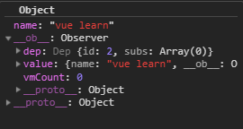

# Vue 数据响应-观察者 Observer

```js
export class Observer {
  value: any;
  dep: Dep;
  vmCount: number; // number of vms that have this object as root $data

  constructor(value: any) {
    this.value = value;
    this.dep = new Dep();
    this.vmCount = 0;
    def(value, '__ob__', this);
    if (Array.isArray(value)) {
      if (hasProto) {
        protoAugment(value, arrayMethods);
      } else {
        copyAugment(value, arrayMethods, arrayKeys);
      }
      this.observeArray(value);
    } else {
      this.walk(value);
    }
  }
  //...
}
```

先看下构造函数：

- 定义 value 属性，即 initData 是传入的 vm.\$options.data
- 创建一个 Dep() ，Dep 是什么后续再说
- 通过 def ，在 value 上绑定 \_\_ob\_\_ 属性
- 通过 walk() 动态观察 value

## def()

这里使用了 def()，起作用是在 value 对象上定义一个数据类型的 **对象属性** \_\_ob\_\_

```js
// E:\github\vue\src\core\util\lang.js

export function def(obj: Object, key: string, val: any, enumerable?: boolean) {
  Object.defineProperty(obj, key, {
    value: val,
    enumerable: !!enumerable,
    writable: true,
    configurable: true
  });
}
```

注意：对象属性类型的 value 设置为 Observer 的 this 引用，并会挂在到 vm.\$options.data 上：



注意上面的 value 是一个 **嵌套引用**。

关于 defineProperty，可以看下：[js 基础 -- 面向对象 1.描述对象属性的属性特征](https://github.com/eminoda/myBlog/issues/2)

## 数组类型判断

将数组类型的数据指向 **预设** 好的 arrayMethods 作为替换：

```js
if (Array.isArray(value)) {
  if (hasProto) {
    protoAugment(value, arrayMethods);
  } else {
    // E:\github\vue\src\core\observer\array.js
    copyAugment(value, arrayMethods, arrayKeys);
  }
  // 内部 再调用 observe
  this.observeArray(value);
}
```

需要注意的是，Vue 加载时就会遍历原生 Array 类型方法，如果后续观察的数组属性执行相关操作，就会对“新元素”也赋予观察属性：

```js
methodsToPatch.forEach(function(method) {
  // cache original method
  const original = arrayProto[method];
  def(arrayMethods, method, function mutator(...args) {
    const result = original.apply(this, args);
    const ob = this.__ob__;
    let inserted;
    switch (method) {
      case 'push':
      case 'unshift':
        inserted = args;
        break;
      case 'splice':
        inserted = args.slice(2);
        break;
    }
    if (inserted) ob.observeArray(inserted);
    // notify change
    ob.dep.notify();
    return result;
  });
});
```

最后 observeArray()，遍历数组内容，再次调用 observe(items[i]) 对数组内每项元素进行观察。

```js
class Observer {
  observeArray(items: Array<any>) {
    for (let i = 0, l = items.length; i < l; i++) {
      observe(items[i]);
    }
  }
}
```

## walk

最终执行 walk(value)

```js
if(){
  // ...
}else {
  this.walk(value);
}
```

在 data 上每个属性都通过 defineReactive 定义访问属性，已达到动态响应效果：

```js
walk (obj: Object) {
    const keys = Object.keys(obj)
    for (let i = 0; i < keys.length; i++) {
    // 定义响应式
      defineReactive(obj, keys[i])
    }
}
```

之后看下：defineReactive

上一篇：[Vue 数据响应-赋予观察属性 observe](./vue_learn_301_reactive_observe.md)

下一篇：[Vue 数据响应-动态响应 defineReactive](./vue_learn_303_reactive_defineReactive.md)
