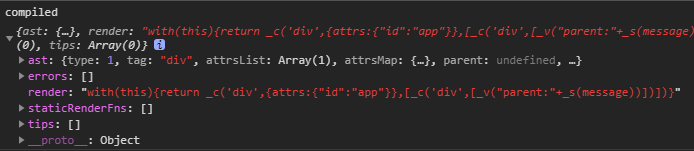

# Vue 渲染-render

看了前面哪些 reactive 动态响应部分，总感觉缺了什么。其实对 Vue 怎么“使用”这一切没有一个说明，只是从一个 **初始化** 流程开始讲述代码而已。

这里对 Vue 渲染 render 机制开始，了解响应式的始末。

由于充满着高阶函数，理解起来会比较困难，先来看一段 **简易版本** 的代码：

## 简易版

从渲染 render 入口开始，渲染方法 render 由 compileToFunctions 转换得到：

```js
var options = {};
var { render } = compileToFunctions(template, options, this);
```

编译转换方法 compileToFunctions 是创建编译器 createComiler 的子属性方法之一：

```js
var baseOptions = {};
var { compileToFunctions } = createComiler(baseOptions);
```

createComiler 是创建编译器工厂 createCompilerCreator 的引用 ，并且 createCompilerCreator 会返回 compile 和 compileToFunctions 两个子属性方法：

```js
var createComiler = createCompilerCreator(function baseCompile() {});
var createCompilerCreator = function createCompilerCreator() {
  return function createCompiler() {
    function compile() {}
    return {
      compile: compile,
      compileToFunctions: createCompileToFunctionFn(compile)
    };
  };
};
```

子属性方法 compileToFunctions ，就是 createCompileToFunctionFn

```js
var createCompileToFunctionFn = function createCompileToFunctionFn(compile) {
  const cache = Object.create(null);
  return function compileToFunctions() {
    const compiled = compile(template, options);
    res.render = createFunction(compiled.render, fnGenErrors);
    return (cache[key] = res);
  };
};
```

经过一系列的方法引用，render 最终得到实现方法。下面逐步详细看下：

## 入口

依旧从 init 初始化方法开始，看下 \$mount 怎么和 **响应** 挂上钩的？

```js
var app = new Vue({
    el: "#app",
    ...
});
```

```js
export function initMixin (Vue: Class<Component>) {
    Vue.prototype._init = function (options?: Object) {
        ...
        // 会进入该条件
        if (vm.$options.el) {
            vm.$mount(vm.$options.el)
        }
    }
}
```

如下 new Vue() 定义了属性 el，在初始化时，就会进入 vm.\$mount() 分支。

## \$mount

在初始化 **声明** 阶段，第一个 Vue.prototype.\$mount 会被定义在 Vue 原型链上， **mountComponent** 中定义了和响应相关的事宜。

```js
// E:\github\vue\src\platforms\web\runtime\index.js
Vue.prototype.$mount = function(el?: string | Element, hydrating?: boolean): Component {
  el = el && inBrowser ? query(el) : undefined;
  return mountComponent(this, el, hydrating);
};
```

紧接着，Vue.prototype.\$mount 会被赋值给变量 mount 中做暂存。重新定义原型方法 Vue.prototype.$mount，作为公用的方法 \$mount。（见 [vm.\$mount( [elementOrSelector] )](https://cn.vuejs.org/v2/api/#vm-mount)）

```js
// E:\github\vue\src\platforms\web\entry-runtime-with-compiler.js
const mount = Vue.prototype.$mount;
Vue.prototype.$mount = function(el?: string | Element, hydrating?: boolean): Component {
  el = el && query(el);
  //...
  const options = this.$options;
  // resolve template/el and convert to render function
  if (!options.render) {
    let template = options.template;
    if (template) {
      //...
    } else if (el) {
      template = getOuterHTML(el);
    }
    if (template) {
      //...
      options.render = render;
      options.staticRenderFns = staticRenderFns;
      //...
    }
  }
  return mount.call(this, el, hydrating);
};
```

由于初始化的时候没有定义 render，所以会进入第一个判断 **if(!options.render)**，然后获取 template 模板并会校验模板的合法性。

获取到 template 后，准备渲染相关方法

```js
// 当 html 模板解析 ok
if (template) {
  //...
  // 调用 模板编译方法
  const { render, staticRenderFns } = compileToFunctions(
    template,
    {
      shouldDecodeNewlines,
      shouldDecodeNewlinesForHref,
      delimiters: options.delimiters,
      comments: options.comments
    },
    this
  );
  options.render = render;
  options.staticRenderFns = staticRenderFns;
  //...
}
```

**compileToFunctions** 开始执行的逻辑，可以看下上面的渲染 **简易版**，这样思路上会有个简单清晰的指引。

**compileToFunctions** 由 **createCompiler** 方法延伸出来

```js
// E:\github\vue\src\platforms\web\compiler\index.js

import { createCompiler } from 'compiler/index';
const { compile, compileToFunctions } = createCompiler(baseOptions);
export { compile, compileToFunctions };
```

而 **createCompiler** 其实就是 **createCompilerCreator** 的引用变量：

```js
// src\compiler\index.js
import { createCompilerCreator } from './create-compiler';
export const createCompiler = createCompilerCreator(function baseCompile(template: string, options: CompilerOptions): CompiledResult {
  const ast = parse(template.trim(), options);
  // ...
  const code = generate(ast, options);
  return {
    ast,
    render: code.render,
    staticRenderFns: code.staticRenderFns
  };
});
```

**createCompilerCreator** 接收一个 **baseCompile** 基础编译函数方法，通过 **高阶函数+偏函数** 形式返回最初 **if(template)** 时所使用的 **compileToFunctions** (createCompileToFunctionFn(compile))

```js
export function createCompilerCreator(baseCompile: Function): Function {
  return function createCompiler(baseOptions: CompilerOptions) {
    function compile(template: string, options?: CompilerOptions): CompiledResult {
      //...

      if (options) {
        //...
      }

      const compiled = baseCompile(template, finalOptions);
      //...
      return compiled;
    }
    // 这里要注意了，返回2个函数，其中一个便是 template 使用的 compileToFunctions
    return {
      compile,
      compileToFunctions: createCompileToFunctionFn(compile)
    };
  };
}
```

在看看最终调用的 **createCompileToFunctionFn**，创建一个空的 cache 缓存对象，执行 compile 编译方法，定义返回 render 渲染函数，并加入 cache ：

```js
// E:\github\vue\src\compiler\to-function.js

export function createCompileToFunctionFn(compile: Function): Function {
  const cache = Object.create(null);

  return function compileToFunctions(template: string, options?: CompilerOptions, vm?: Component): CompiledFunctionResult {
    options = extend({}, options);
    //...
    const key = options.delimiters ? String(options.delimiters) + template : template;
    if (cache[key]) {
      return cache[key];
    }
    // compile
    const compiled = compile(template, options);
    //...
    res.render = createFunction(compiled.render, fnGenErrors);
    res.staticRenderFns = compiled.staticRenderFns.map(code => {
      return createFunction(code, fnGenErrors);
    });
    //...
    return (cache[key] = res);
  };
}
```

和起点入口的 **compileToFunctions** 放在一起做个关联比较，应该对参数的传递有了个概念。

```js
const { render, staticRenderFns } = compileToFunctions(
  template,
  {
    outputSourceRange: process.env.NODE_ENV !== 'production',
    shouldDecodeNewlines,
    shouldDecodeNewlinesForHref,
    delimiters: options.delimiters,
    comments: options.comments
  },
  this
);
```

```js
function createCompileToFunctionFn(compile: Function): Function {
  return function compileToFunctions(template: string, options?: CompilerOptions, vm?: Component): CompiledFunctionResult {
    // ...
    return (cache[key] = res);
  };
}
```

绕了那么多全，终于走到头了（原来高阶函数该这么玩）。之后就要看 render 中细节怎么做渲染的。

熟悉代码的执行“路径”后，接下来拎出几个方法，看下如何和响应式扯上关系？

看下 **compileToFunctions** 内部会运行传入的方法 compile ：

```js
function compile(template: string, options?: CompilerOptions): CompiledResult {
  //...
  return compiled;
}
```

简单看下编译后的结果：



这里的 **ast** 暂时当做类似浏览器引擎解析做的 **词法解析**，主要这里定义了 render 方法，并且用 **with** 把执行域放在了 this 下。

既然有了 render ，就能在第一次声明 \$mount 中执行相关逻辑（runtime 中那个）

```js
const mount = Vue.prototype.$mount;
Vue.prototype.$mount = function (
  el?: string | Element,
  hydrating?: boolean
): Component {
  el = el && inBrowser ? query(el) : undefined
  return mountComponent(this, el, hydrating)
}
export function mountComponent (
  vm: Component,
  el: ?Element,
  hydrating?: boolean
): Component {
    //...
    updateComponent = () => {
      vm._update(vm._render(), hydrating)
    }
    new Watcher(vm, updateComponent, noop, {//...}, true /* isRenderWatcher */)
  //...
}
// runtime-compiler
Vue.prototype.$mount = function() {
  //...
  return mount.call(this, el, hydrating);
};
```

再回到 Watcher ，其实定义的 updateComponent 在其内部执行了 this.get()，即运行了 render() ，从而开始了动态响应渲染。
